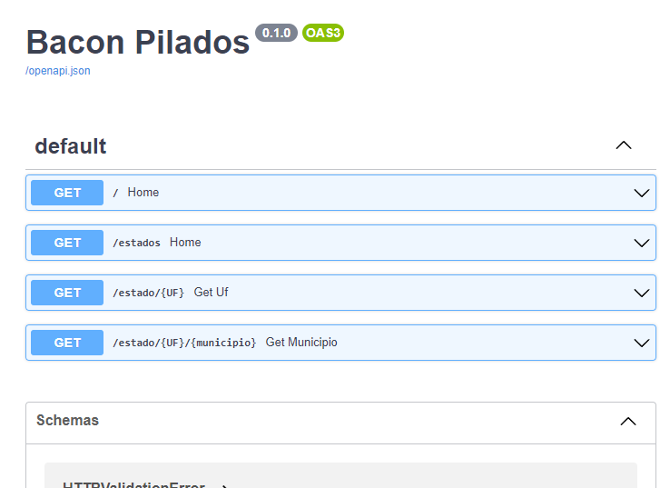
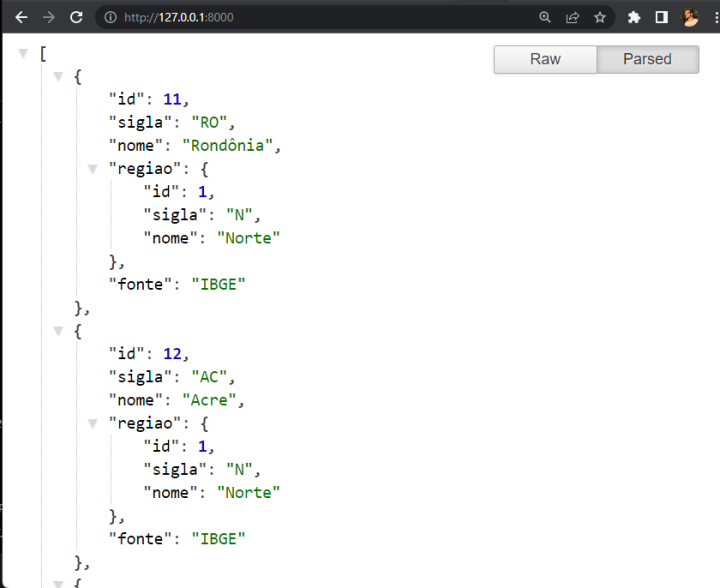
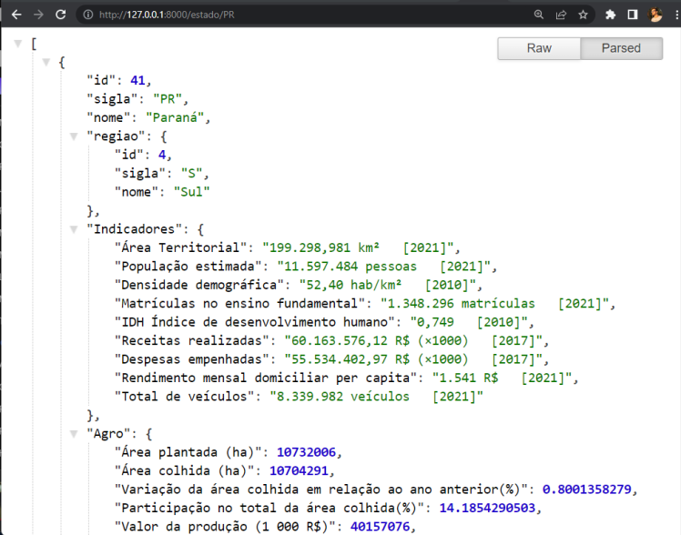
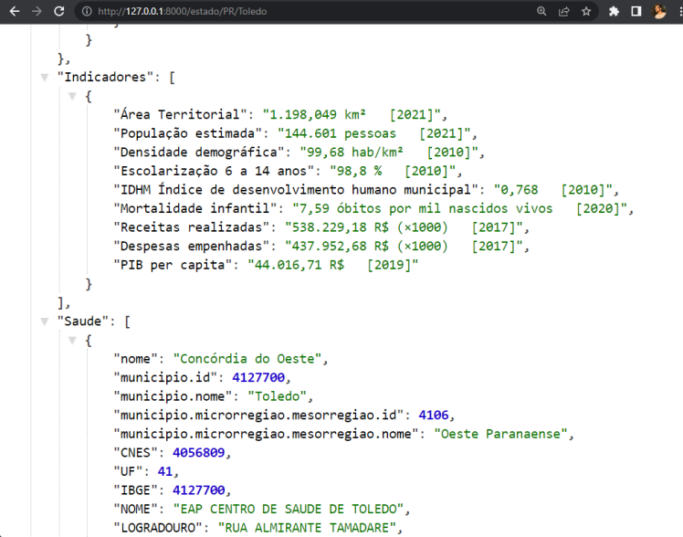

# Hackathon Pig-Data 2022
API desenvolvida através do desafio do Hackathon Pig Data 2022 em 2 dias.

## O Desafio:
> "Desenvolver uma API que realize buscas e retorne dados relacionados aos assuntos do próximo slide. A busca deve ser baseada em dados públicos, os dados devem retornar de forma estruturada (JSON), com as devidas relações, se quando existentes."


## Como executar: 
### Instalando os requimentos necessários:
```
pip install -r requirements.txt
```
### Executando a API:
```
python main.py
```

## Resolução do problema: 
### As bases de dados utilizadas foram: 
<ul>
  <li>IBGE</li>
  <li>INEP</li>
  <li>DataSUS</li>
</ul>


<p>A API desenvolvida realiza importa dados através da API do IBGE, importa as bases de dados do INEP e DataSUS em CSV, faz um WebScraping da página inicial do IBGE.</p>

## Imagens da API funcionando:





